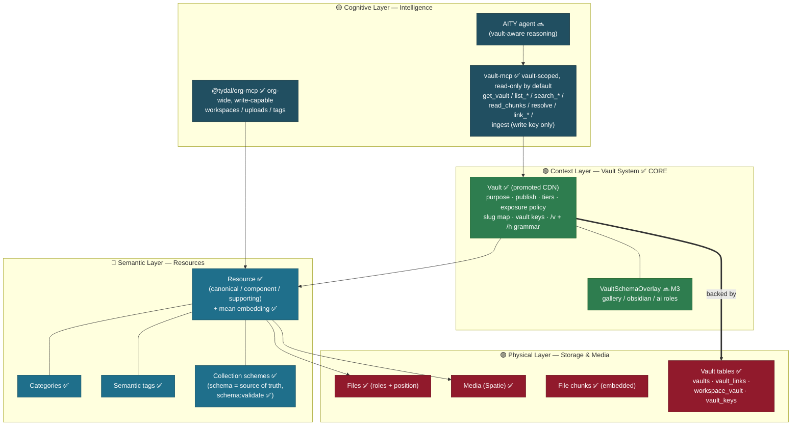
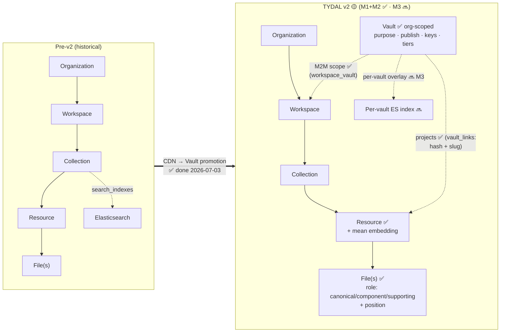
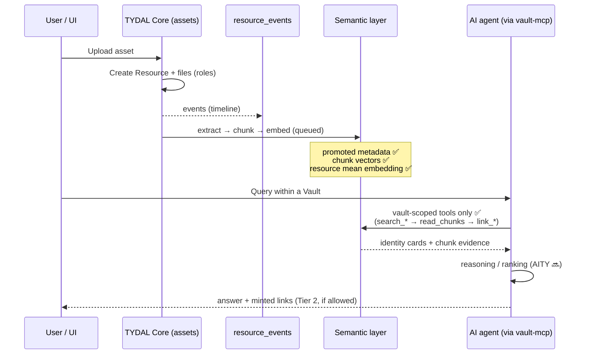
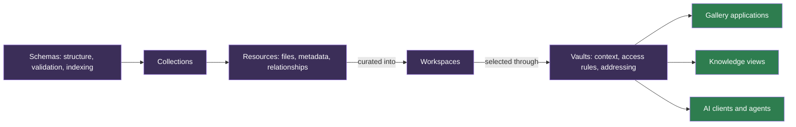

# 🗺️ TYDAL — System Diagrams

Visual companion to [`ARCHITECTURE_AND_ROADMAP.md`](ARCHITECTURE_AND_ROADMAP.md).
Diagrams are [Mermaid](https://mermaid.js.org/) and render directly on GitHub.

Status legend: ✅ exists · 🟡 partial · 🔜 planned
(updated 2026-07-03 — Milestones 1 & 2 closed)

---

## 1. Layered architecture — Data → Knowledge → Intelligence

---

## 2. Data model evolution (current → v2)

Key shift: file-centric → **resource-centric** ✅; global → **vault-scoped**
addressing ✅ (vault-scoped *semantic search* lands with M3); static →
**schema-driven** indexing (mappings schema-derived ✅, per-vault indexes 🔜);
embedding per file → **per resource** ✅ (mean aggregation);
CDN delivery → **Vault projection layer** ✅ (M2M over workspaces, not a
hierarchy node).

---

## 3. Ingestion & AI data flow

> **Invariant (enforced ✅):** external AI never touches the raw DB — it
> reasons **only** through the vault-scoped MCP tools, and the vault's tier
> policy decides what each verb may return.

---

## 4. Resource model and consuming experiences

This diagram shows relationships, not a file-copy pipeline. The same resource
can participate in several workspace selections and Vault contexts. Collections
organize resources; galleries and knowledge views are consuming applications.
See [product terminology](ARCHITECTURE_AND_ROADMAP.md).
