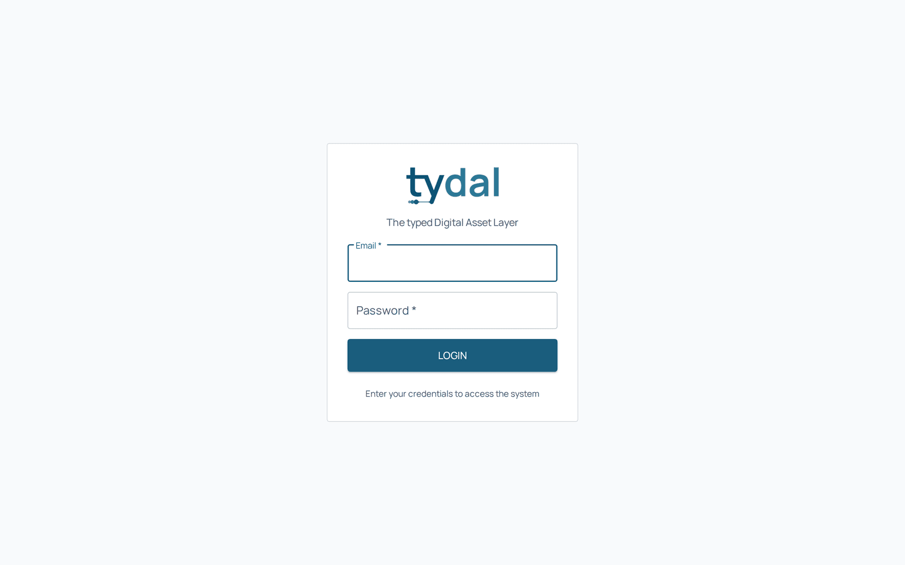
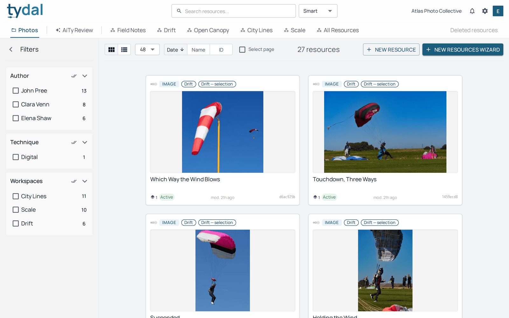
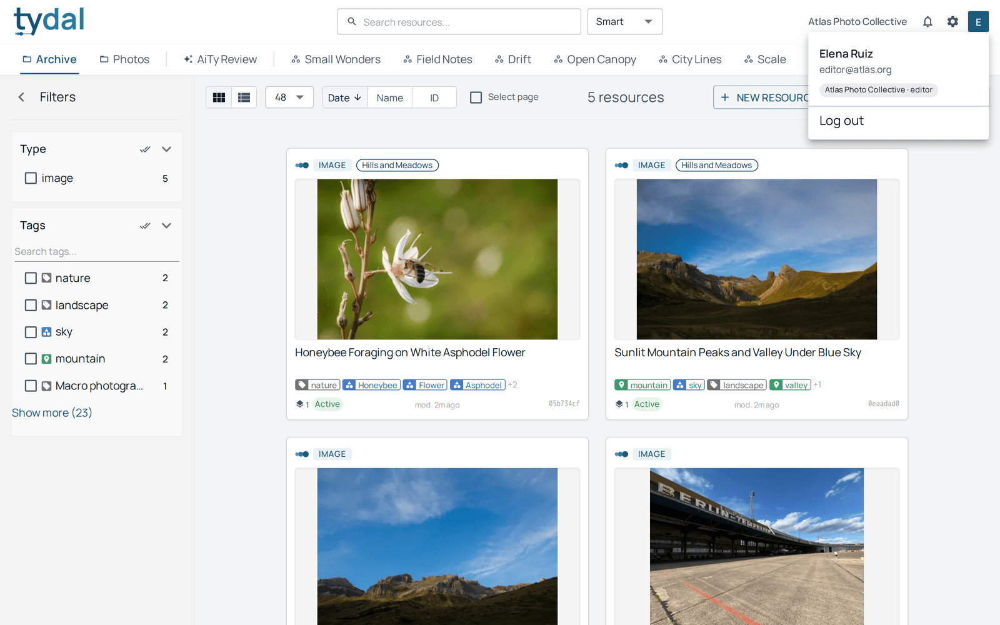
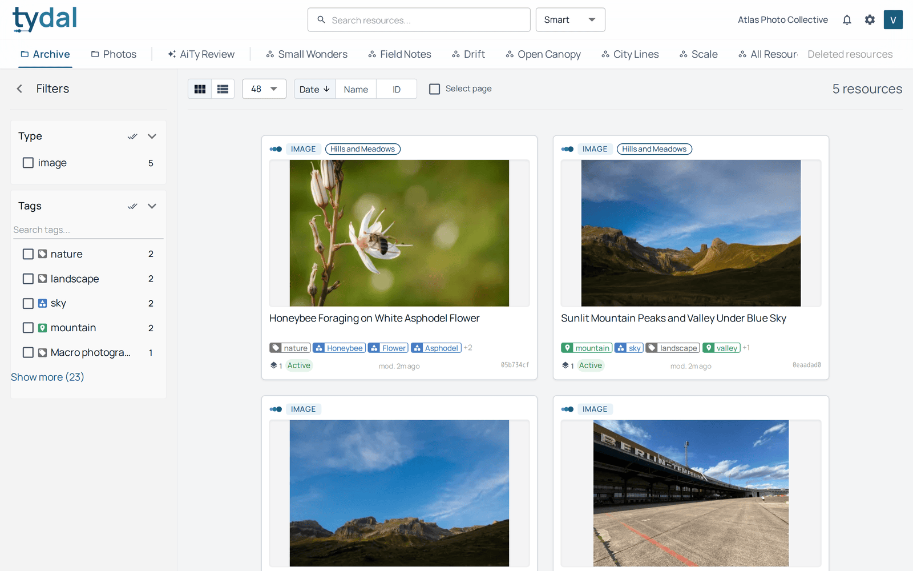
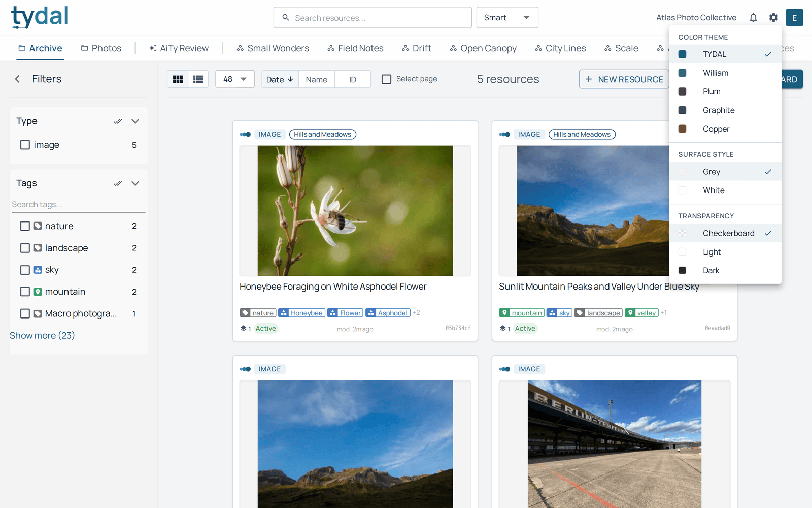

# 1 · Getting started

[TYDAL user guide](README.md) › Getting started

## Signing in

Open the address your administrator gave you and sign in with your email and
password.

TYDAL accounts are created by an administrator. There's no self sign-up. If
you've forgotten your password, ask your administrator. Too many failed attempts
make the page wait a little before you can try again.

## The screen

After signing in you land on the **library**: the resources of your organization.

From left to right, the top bar has:

- the **TYDAL logo**, which always brings you back to the library;
- the **search box** and its search mode (see [chapter 2](02-library.md));
- the **organization settings** button (administrators and owners) and the
  **platform administration** button (platform administrators only);
- your **organization's name**. If you belong to more than one, click it to
  switch. Everything on screen changes to the chosen organization;
- the **basket** (appears when it holds something, see [chapter 5](05-basket.md));
- the **notifications** bell;
- the **appearance** menu (the gear);
- your **initial**, which opens your user menu.

The second row lists your **collections** first (*Photos* here), then **AiTy
Review**, then your **workspaces** (*Drift*, *City Lines*…, and *All Resources*).
**Deleted resources** at the far right opens the trash.

## Your user menu and your role

Click your initial to see your name, your email and **your role in the current
organization**, then **Log out**.

What you can do depends on that role. The table in the
[guide's introduction](README.md#roles-at-a-glance) sums it up. TYDAL only shows
the buttons your role can use, so a **viewer**'s library has no *New resource*
buttons, for example:

If you need a button you can't see, ask an administrator of your organization to
change your role.

## Appearance

The gear opens the appearance menu: a **colour theme** (the default is *TYDAL*),
a **surface style**, and the **transparency** backdrop drawn behind images with
transparent areas. These choices are personal and only affect your browser.

---

← [Contents](README.md) · [Finding resources](02-library.md) →
