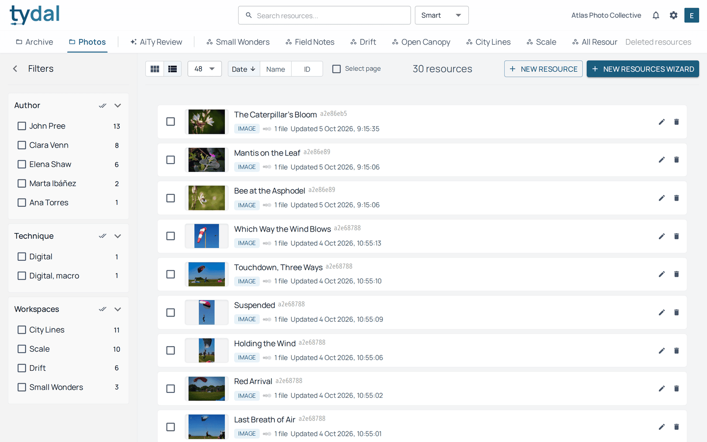
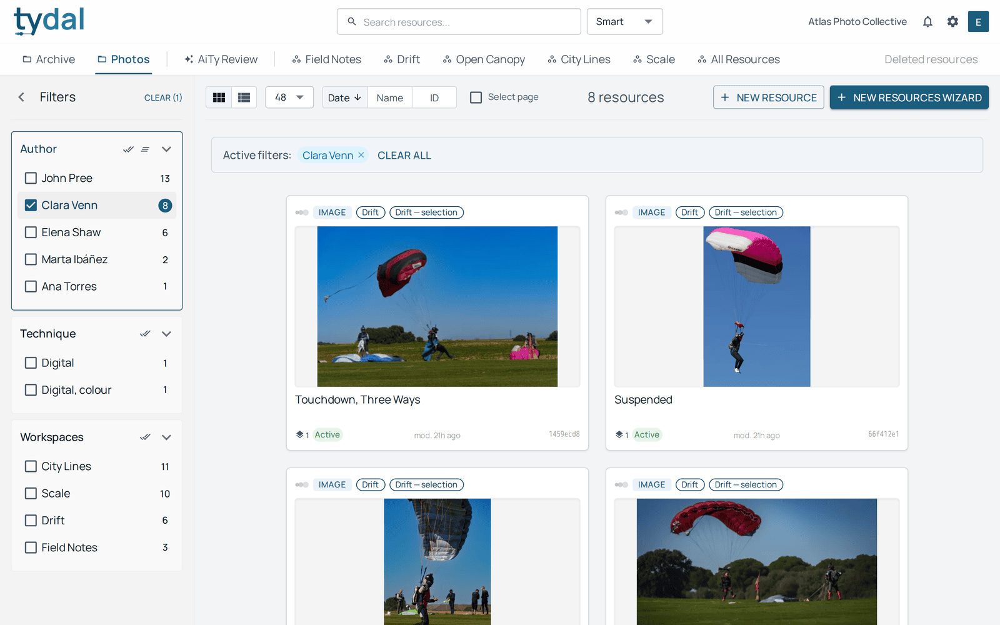
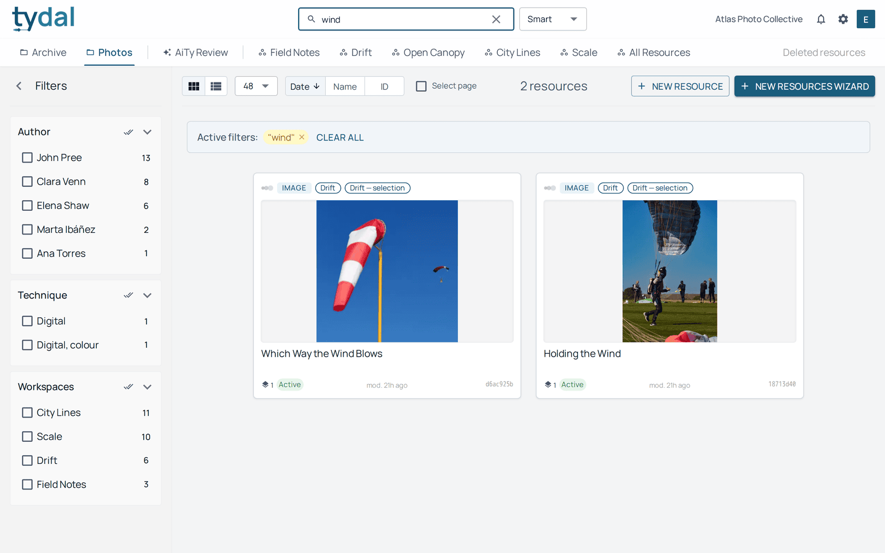
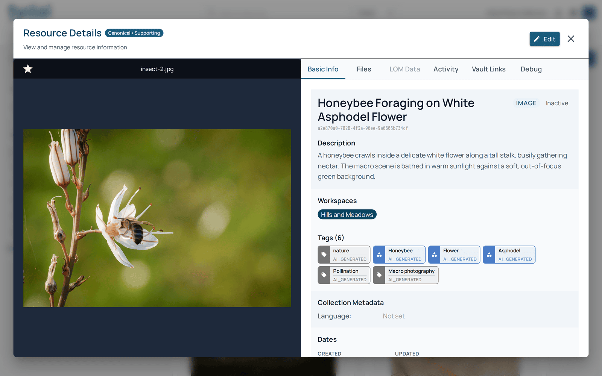
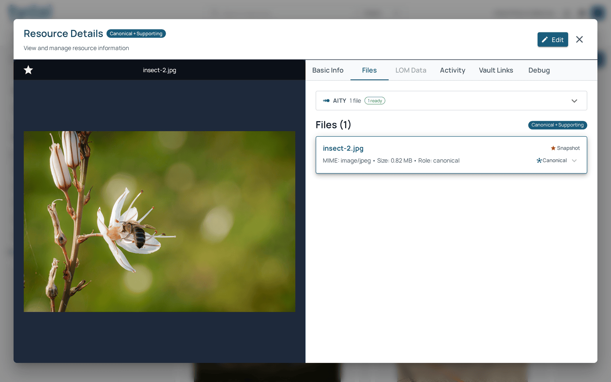
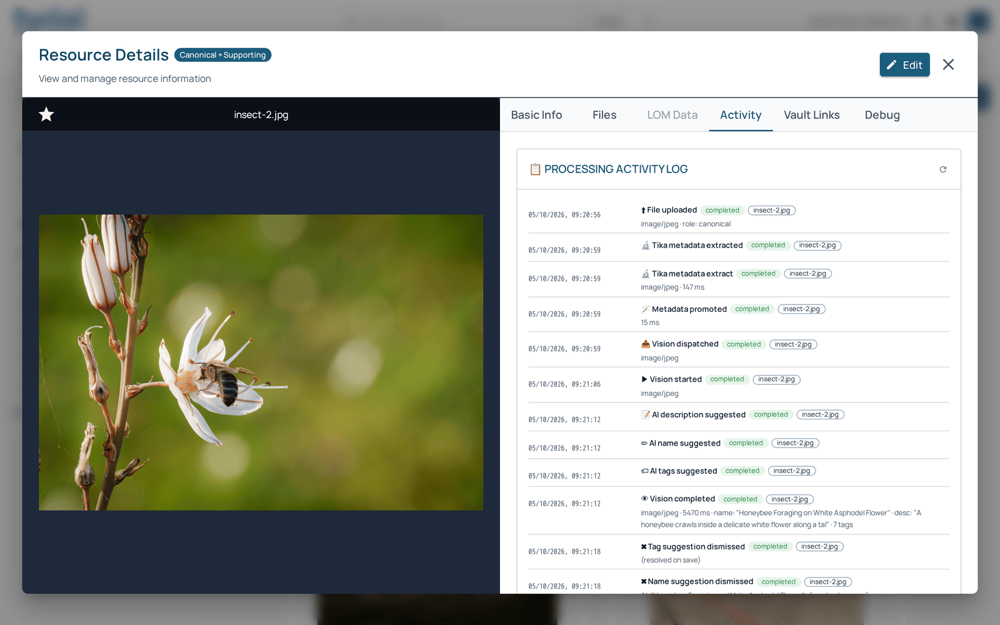

# 2 · Finding resources

[TYDAL user guide](README.md) › Finding resources

## Collections, workspaces and the library

The second row of the top bar picks what the library shows:

- a **collection** (*Photos*, *Archive*…) shows every resource stored in it;
- a **workspace** (*Drift*, *City Lines*…) shows the resources gathered in that
  group, whatever collection they come from;
- **All Resources** is the organization-wide workspace.

## Browsing

Above the results:

- **Grid / list** switches between cards and a compact list.
- **12 · 24 · 48…** sets how many resources a page shows.
- **Date · Name · ID** sorts. Click the active one again to reverse the order.
- **Select page** puts every resource on the page in your basket
  ([chapter 5](05-basket.md)).
- The total count, and the buttons to add resources ([chapter 3](03-adding-resources.md)).

Each card shows the resource's **type** (IMAGE, DOCUMENT…), the **workspaces** it
belongs to, its preview and **name**, how many **files** it has, when it was last
modified, and a short **ID** you can quote to a colleague.

## Filtering

The **Filters** panel on the left lists the values found in the current results:
the collection's own fields (here *Author* and *Technique*), the **workspaces**
and, when resources are tagged, the **tags** ([chapter 4](04-tags.md)). The
numbers are how many resources have each value.

Tick values to narrow the results. Ticked filters appear as chips above the
results; **Clear all** (or **CLEAR** in the panel) removes them. The two small
icons beside each filter's title tick all or none of its values.

Which fields can be filters is decided by the collection's scheme, which your
administrator sets up.

## Searching

Type in **Search resources…** and press Enter. Beside the box, choose how your
words match (the choice is only offered when a collection is open):

- **Smart** (the default): a broad search over names, descriptions, fields and
  file text. Where the collection supports it, results are also ranked by
  *meaning*, so a resource about a "windsock" can turn up for "wind" even
  without the exact word.
- **Contains**: all your words must appear, in any order, in the name, the
  description or a tag. Part of a name also matches.
- **Exact**: your words must appear together, as a phrase, in the name, the
  description or a tag. If nothing matches exactly, TYDAL says so and shows the
  Smart results instead.

Search and filters combine: the search runs inside whatever is filtered.

## Opening a resource

Click a card to open the resource. The preview is on the left and the details on
the right, in tabs:

- **Basic Info**: name, state (*Live*, *Draft* or *Archived*, beside the type at
  the top; see [chapter 5](05-basket.md#live-draft-archived)), description,
  workspaces, tags, the collection's fields and dates.
- **Files**: the files that make up the resource and their **role**:
  - *Canonical*: the main file; the resource's text and metadata come from it.
  - *Supporting*: attachments, such as a cover or extra photos, that travel with
    it.
  - *Component*: used when several files are equal parts of one whole, such as
    the letters of a correspondence.

  The star marks the file used as the resource's preview (*Snapshot*). The **AITY**
  bar above the list shows what the AI made of each file.

  

- **Activity**: the resource's history: when files were uploaded, what changed,
  and whether a change came from a person or from AiTy.

  

- **Vault Links**: where the resource is shared outside TYDAL. Each row is a
  vault and its address, with buttons to open or copy it. Empty means the
  resource isn't shared anywhere ([chapter 6](06-workspaces-and-vaults.md)).

  

- **LOM Data** (for learning resources) and **Debug** (technical detail) are for
  specialists. You can ignore them.

Editors see **Edit** at the top right for resources they uploaded. Administrators
see it on every resource ([chapter 3](03-adding-resources.md#editing-a-resource)).

## Asking a workspace

When a workspace is open, **Ask AiTy** (top right) lets you ask a question in
plain language about the documents in that workspace. AiTy answers from their
contents and lists the resources it used, so you can check its sources.

---

← [Getting started](01-getting-started.md) · [Contents](README.md) · [Adding resources](03-adding-resources.md) →
