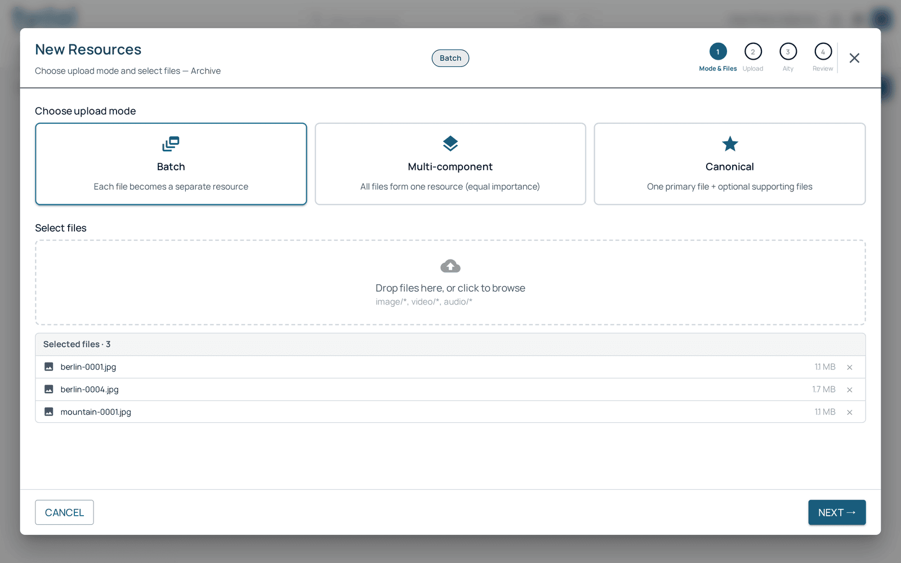
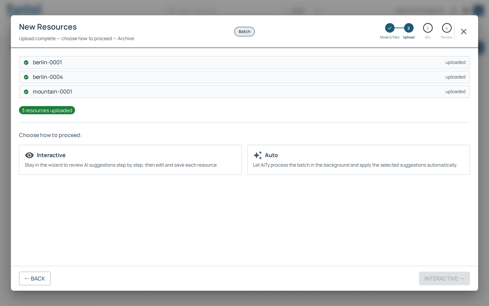
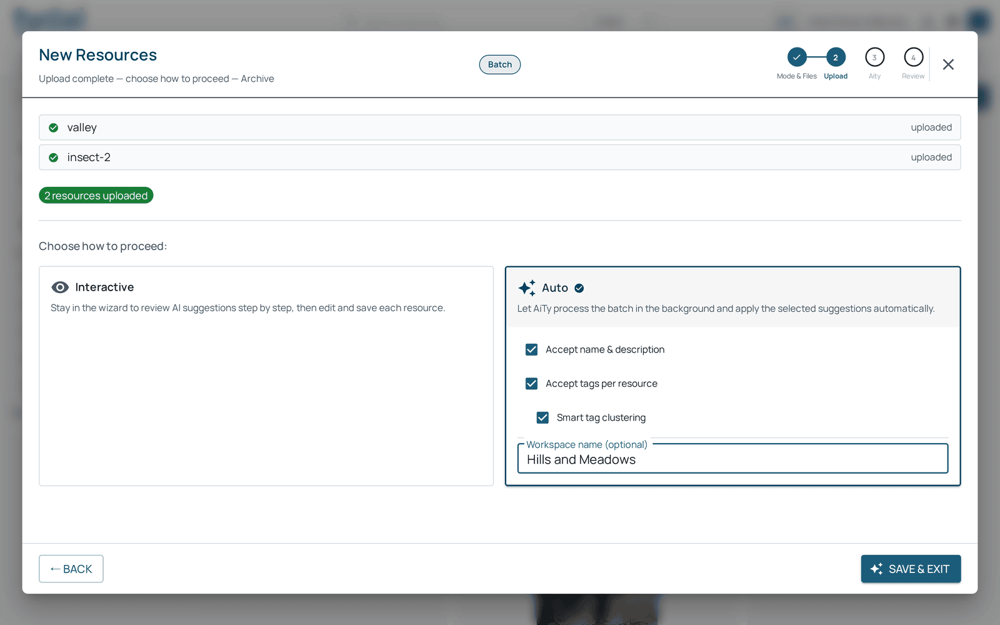
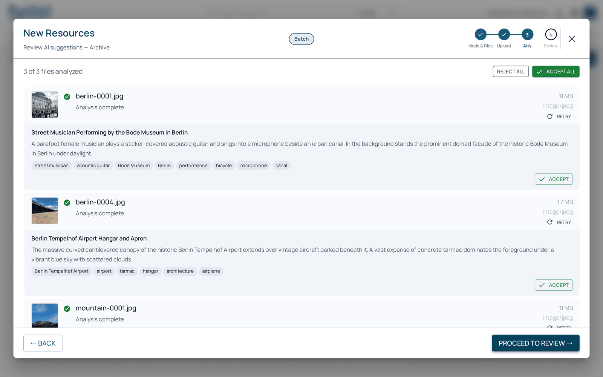
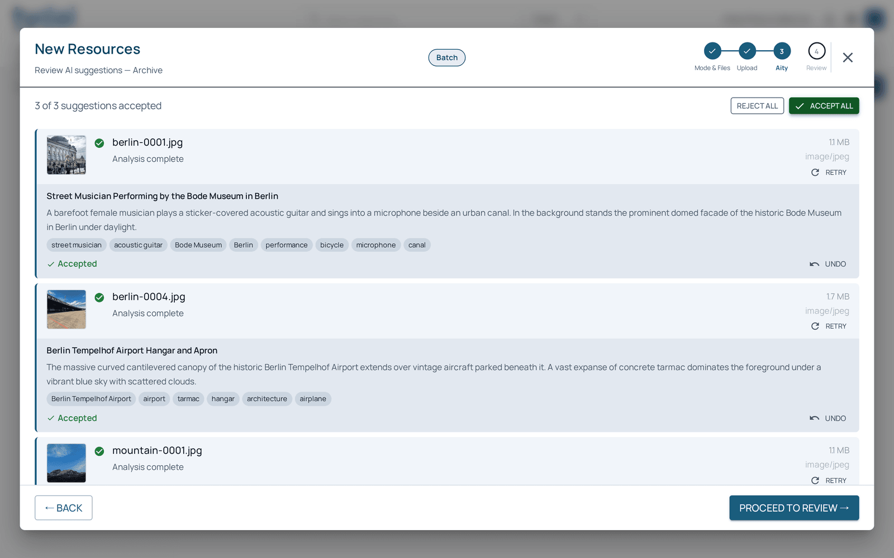
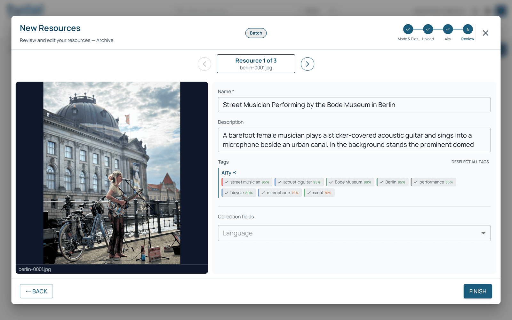
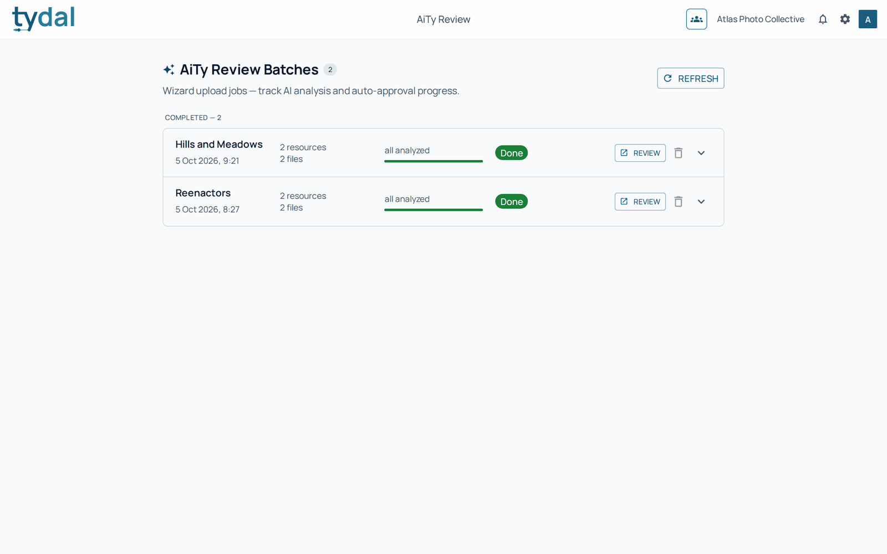
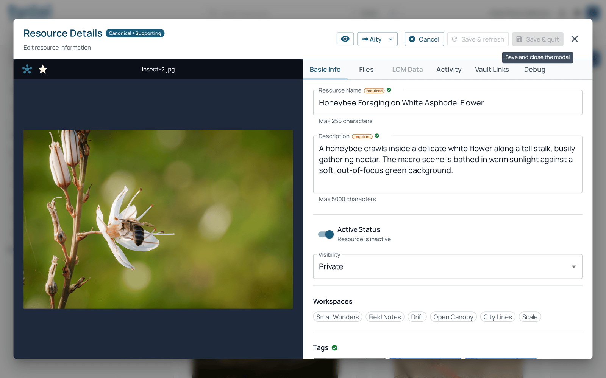

# 3 · Adding resources

[TYDAL user guide](README.md) › Adding resources

*Editors, administrators and owners.*

Open the collection the resources should go into, then choose one of the two
buttons at the top right of the library:

- **New resource**: one resource at a time, filled in by hand in the resource
  form (name, description, the collection's fields, files).
- **New resources wizard**: many files at once, with AI suggestions. The rest of
  this chapter is about the wizard.

## The wizard, step by step

The wizard has four steps, shown at its top right: **Mode & Files**, **Upload**,
**Aity**, **Review**. The collection you're adding to is named under the title.

### 1 · Mode & files

Choose how the files become resources:

| Mode | Use it when |
|---|---|
| **Batch** | Each file is its own resource: a set of photographs, a folder of reports. |
| **Multi-component** | All the files together are *one* resource, as equal parts: the pages of a letter, the tracks of an album. |
| **Canonical** | One main file plus optional supporting files: a book and its cover, a video and its subtitles. |

Then drop the files onto the box or click it to browse. Files the collection
doesn't accept are refused here. The list shows what you've chosen; remove any
with the cross.

If the collection has **required fields** (an *Author* on a photo-exhibition
collection, say), a **Required by this collection** panel appears below the
files, with one box per required field. What you type there is applied to every
resource in this upload; you can still change it per resource in **Review**.
**Next** stays greyed out until every required field has a value, and the panel
names the ones still missing. Collections without required fields don't show the
panel; their optional fields are filled in at **Review**.

Click **Next**.

### 2 · Upload

The files upload one by one, each with a tick when it's done. A file that fails
shows the reason beside it, and its resource is not created. If none of them
could be uploaded, the wizard says why and offers only **Back**, so you can
correct it and try again.

**Back** is available once the uploads finish. If you come back with the same
files, mode and step-1 values, **Next** returns to the upload already made and
only tries the failed files again. If you change any of them, the earlier upload
is discarded and the files are uploaded afresh.

Then choose how to continue:

- **Interactive**: stay in the wizard and review what the AI suggests for each
  resource before saving. Recommended when you want to read every title.
- **Auto**: let AiTy finish in the background and apply its suggestions by
  itself. You choose what it may apply (name and description, tags), can let it
  merge near-identical tags (**Smart tag clustering**), and can give the batch a
  workspace name. Follow its progress in **AiTy Review** (below). Auto works
  for editors as well as administrators: the batch is a system workspace that
  anyone who can upload resources may open. If the batch can't be created or
  started, the wizard stays open and shows the reason instead of closing.

### 3 · Aity: the AI's suggestions

AiTy looks at each file and proposes a **name**, a **description** and **tags**.
This takes a few seconds per file; the counter at the top left says how many are
done.

For each file you can **Accept** its suggestions, or **Retry** for a new
attempt. **Accept all** and **Reject all** act on every file at once. Nothing is
final yet: you'll see everything again in the next step.

### 4 · Review

Go through the resources one by one with the arrows at the top. For each, you
can type the name and description yourself or click **Apply suggestion** to use
AiTy's, and click a suggested tag (**+ street musician**, **+ canal**…) to add it. The
percentage beside a tag is how confident AiTy is. Below them are the
collection's own fields, already filled with anything you entered at step 1.

**Finish** saves everything and makes the resources visible in the library.

If you close the wizard after files have uploaded, it asks whether to **keep**
the resources (they're added to the collection as they are, named after their
files) or **delete them all**. Until the wizard finishes, the new resources are
drafts that nobody else sees. If you choose while a file is still uploading,
the dialog shows **Finishing uploads…** and waits for that file, so its resource
is kept or deleted with the others; files that hadn't started uploading are
left out. If some of them can't be kept or deleted, the
wizard doesn't close: it lists them with the reason and offers **Retry**, or
**Leave anyway**, in which case those stay drafts. If the wizard is interrupted
(a closed tab, a lost connection) or you leave anyway, TYDAL clears those drafts
automatically after a while, files and all.

## AiTy Review: following Auto batches

**AiTy Review** in the second row lists the batches sent with **Auto**: their
name, how many resources and files they hold, how far the analysis has got, and
whether they're done. **Review** opens the batch's resources so you can check
what was applied, with **Auto-approve all** to apply any remaining suggestions
and **View log** to see what was done. The bin removes a batch that hasn't been
reviewed yet.

## Who owns a title

TYDAL remembers whether each name, description and tag set was written by a
person or applied from an AI suggestion (see the resource's **Activity** tab).
In **Interactive** mode and in the resource editor, AiTy only *suggests*:
nothing changes until you click. **Auto** batches, and **Auto-approve all**
(offered when you open a batch from AiTy Review), apply the suggestions
directly, so check the batch afterwards.

## Editing a resource

Open a resource and click **Edit**. Editors can edit the resources they
uploaded; administrators and owners can edit any resource.

In edit mode you can change the name and description, the **state** (*Live* or
*Archived*; see [chapter 5](05-basket.md#live-draft-archived)), the **workspaces** the
resource belongs to (click a workspace to add or remove it), its **tags**
([chapter 4](04-tags.md)) and the collection's fields. The **Aity** menu at the
top asks the AI for fresh suggestions. Save with:

- **Save & refresh**: save and keep editing;
- **Save & quit**: save and close;
- **Cancel**: throw away your changes.

On the **Files** tab (in edit mode) you can add files, change a file's role, or
choose which file is the preview (the star).

---

← [Finding resources](02-library.md) · [Contents](README.md) · [Tags](04-tags.md) →
