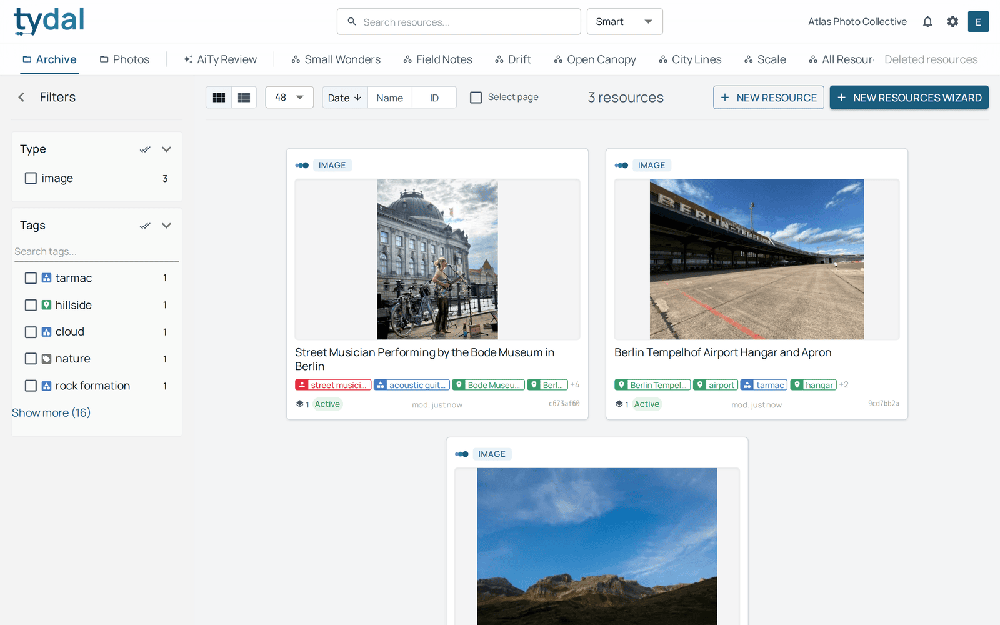
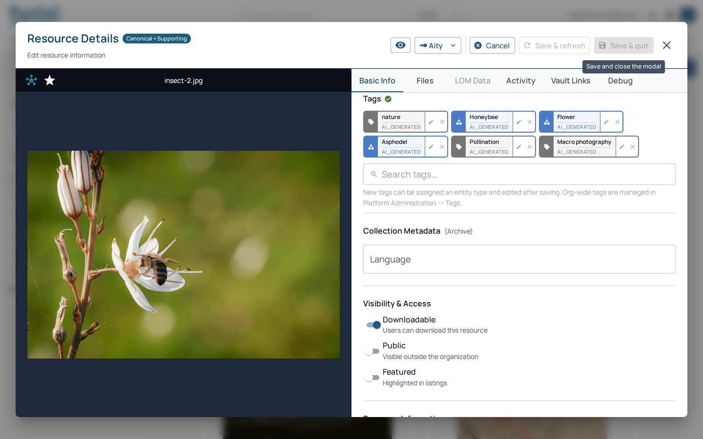
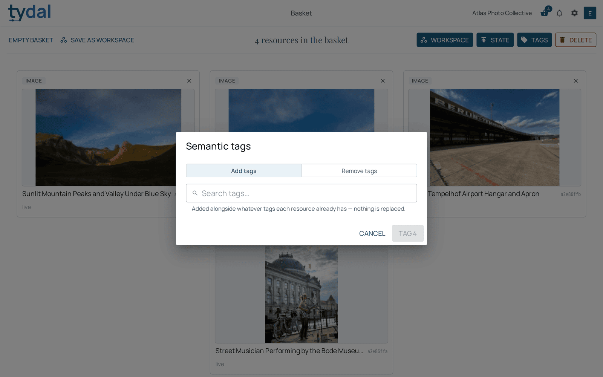
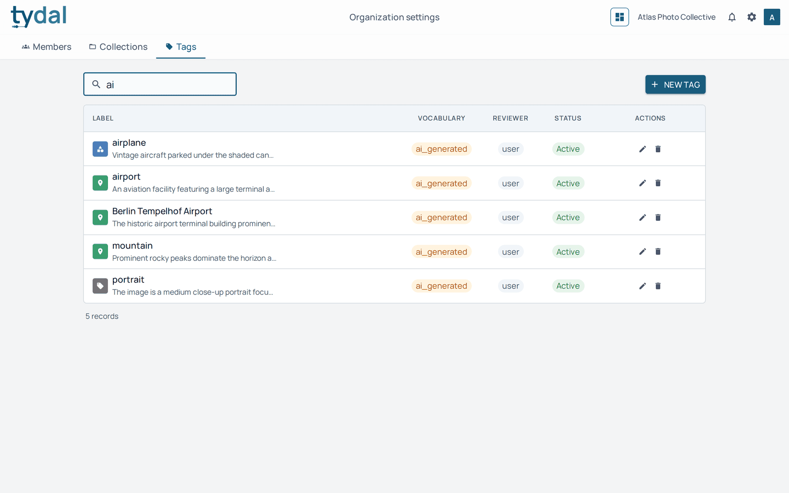

# 4 · Tags

[TYDAL user guide](README.md) › Tags

*Everyone sees tags. Editors and up add and remove them.*

Tags are short labels that describe what a resource is about: *valley*,
*street musician*, *Berlin*. They work across collections and
workspaces, so they're the easiest way to find related things.

## Typed tags

Every TYDAL tag also says **what kind of thing** it names, shown by its icon and
colour:

| Type | Colour | Examples |
|---|---|---|
| **Person** | red | a photographer, a sitter |
| **Organization** | yellow | a museum, a regiment |
| **Place** | green | a city, a valley |
| **Thing** | blue | an object or concept: *bicycle*, *microphone* |
| **Tag** | grey | anything else: *portrait*, *sepia* |

Typing matters for search and for AI tools. "Asphodel" as a *thing* is a flower;
"Asphodel" as a *place* would be somewhere on a map.

## Where tags come from

- **AiTy suggests them** when files are uploaded (see
  [chapter 3](03-adding-resources.md)), with a confidence percentage. You decide
  which to keep. Accepted AI tags are labelled *ai_generated* in the organization's
  tag list.
- **People add them** in the resource editor or, for many resources at once,
  from the basket.
- **Administrators curate them** in Organization settings → Tags
  ([chapter 8](08-organization-settings.md)).

## Finding by tag

Tagged resources get a **Tags** filter in the library's left panel, with its own
search box (useful when there are many). Tick a tag to see only the resources
that carry it. Cards show their first few tags, and **+4** means four more.

## Tagging one resource

Open the resource, click **Edit**, and scroll to **Tags**. Each tag in the list
can be removed. **Search tags…** finds an existing tag; typing a new word offers
to create it. A new tag can be given its type, and edited further after saving.
Save with **Save & refresh** or **Save & quit**.

Reusing an existing tag is better than creating a near-duplicate (*colour* and
*color*), because filters and AI tools treat them as different tags.

## Tagging many resources at once

Put the resources in the basket ([chapter 5](05-basket.md)), then **Tags**:

- **Add tags** adds the chosen tags *alongside* the ones each resource already
  has. Nothing is replaced.
- **Remove tags** takes the chosen tags off wherever they appear and leaves the
  others alone.

## The organization's vocabulary

Administrators see every tag of the organization in **Organization settings →
Tags**: its label and description, its **vocabulary** (where it came from:
*organization*, *user*, *ai_generated*), its **reviewer** (*user* when a person
approved it, *aity* when the AI did), and whether it is **active**. From there
they can create tags, fix a label or type, or delete one.

---

← [Adding resources](03-adding-resources.md) · [Contents](README.md) · [The basket and bulk actions](05-basket.md) →
