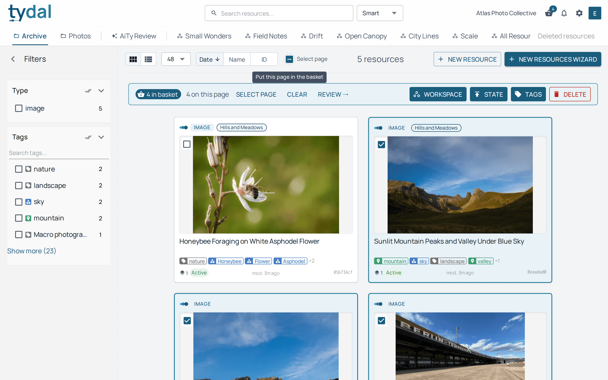
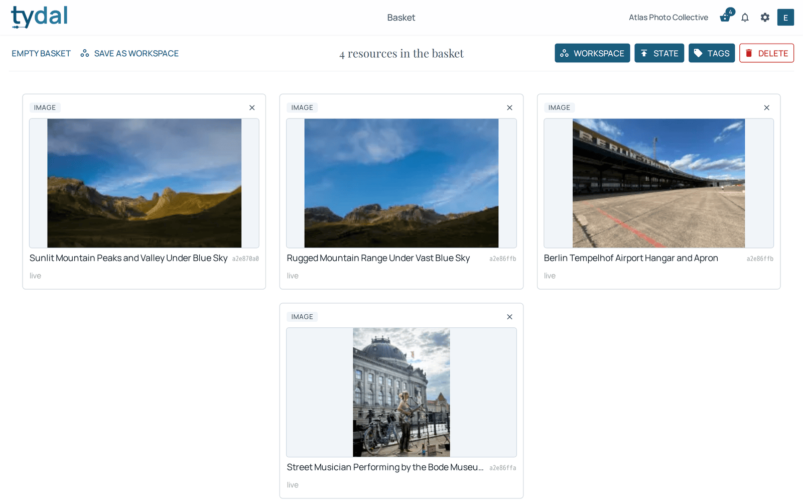
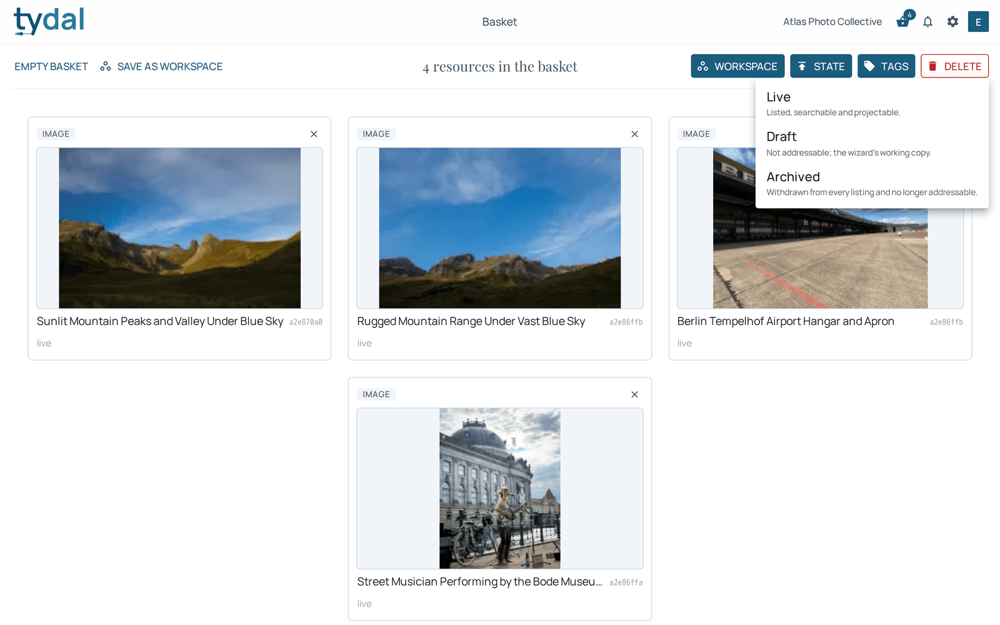

# 5 · The basket and bulk actions

[TYDAL user guide](README.md) › The basket and bulk actions

*Editors and up.*

The basket is how you act on many resources at once: add them to a workspace,
change their state, tag them, or delete them.

## Filling the basket

Hover over a card and tick the box at its top left (in the list layout, tick the
row). Once something is in the basket, the boxes stay visible on every card.
**Select page** ticks everything on the current page.

The basket **keeps its contents** while you change page, sort, filter, or switch
collection or workspace, so you can gather resources from different places. The
bar above the results reminds you how many are in the basket and how many of
those are on the page you're looking at. From the bar you can **Clear** the
basket or click **Review →** to open it.

The basket is personal: other people don't see it, and it holds up to 200
resources. The basket icon in the top bar shows the count on every page.

## The basket page

The basket page lists what you've gathered. The cross on a card takes it out;
**Empty basket** clears everything. **Save as workspace** (administrators and
owners, who can create workspaces) turns the basket into a real, named workspace
that others can see, for example a shortlist you want to share. Editors can
instead add the basket to an existing workspace with **Workspace**.

## Bulk actions

The buttons at the top right act on everything in the basket:

| Button | Does |
|---|---|
| **Workspace** | Add the resources to a workspace, or take them out of one. |
| **State** | Set them to *Live* or *Archived* (below). |
| **Tags** | Add or remove tags without touching their other tags ([chapter 4](04-tags.md)). |
| **Delete** | Move them to the trash, where they can be restored ([chapter 7](07-trash.md)). |

### Live, Draft, Archived

A resource's **state** decides whether anyone sees it:

- **Live**: listed, searchable, and shared through any vault that includes it.
  The normal state.
- **Draft**: a working copy that isn't listed or shared. New resources are drafts
  until the upload wizard finishes. Draft is only for resources being created:
  you can't send an existing resource back to it, because unfinished drafts are
  cleared automatically.
- **Archived**: withdrawn from every listing and from every vault, but kept.
  TYDAL asks you to confirm before archiving, and you can set the resource back to
  Live at any time.

### When some resources can't be changed

You may gather resources you aren't allowed to change, for example an editor's
basket holding a colleague's resources. TYDAL then changes the ones it can and
tells you how many it skipped. The skipped ones **stay in the basket**, so an
administrator can finish the job.

Large batches (more than about 25 resources) are processed in the background.
TYDAL then says the list will catch up in a moment.

---

← [Tags](04-tags.md) · [Contents](README.md) · [Workspaces and vaults](06-workspaces-and-vaults.md) →
