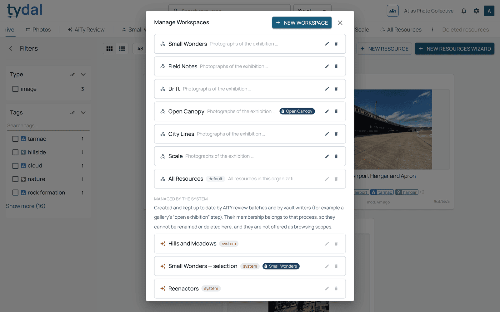
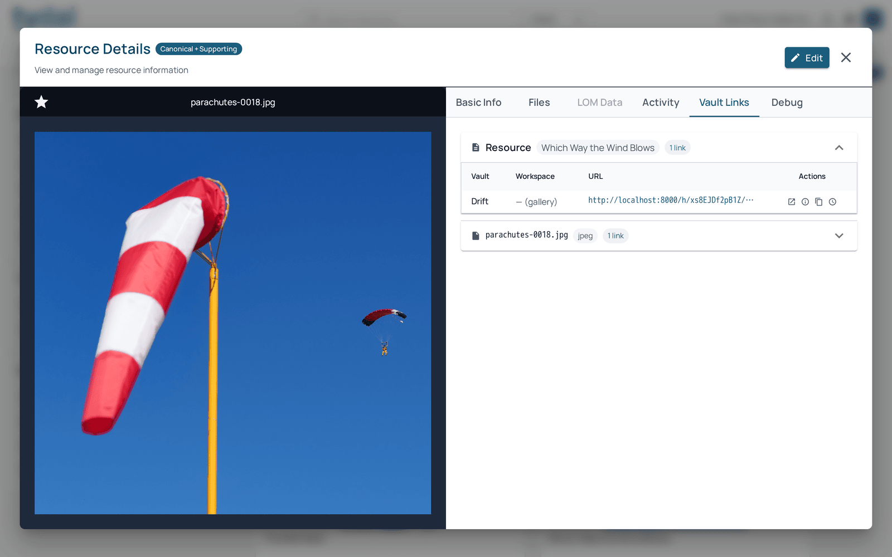
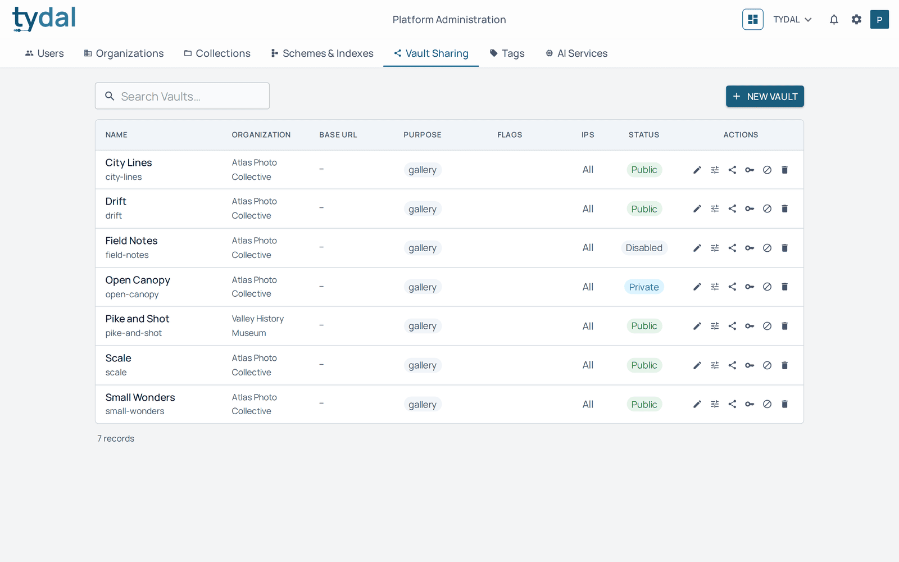
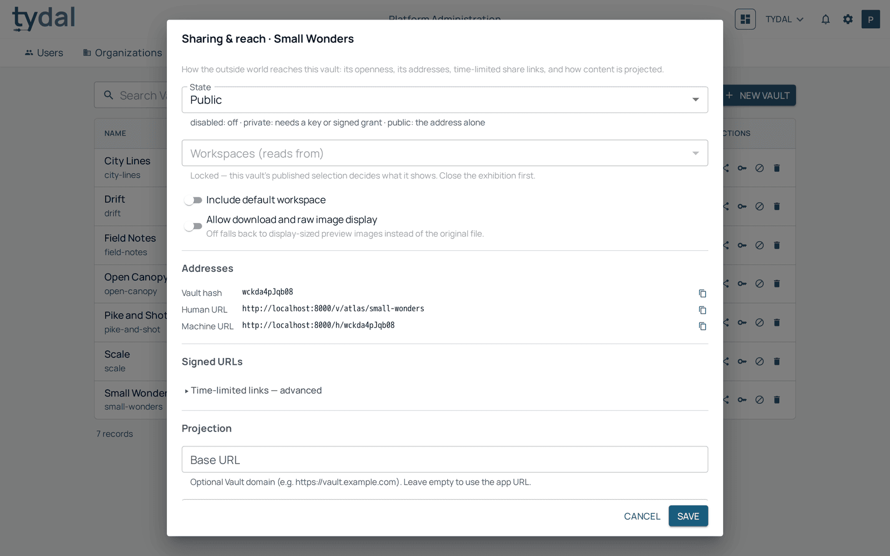
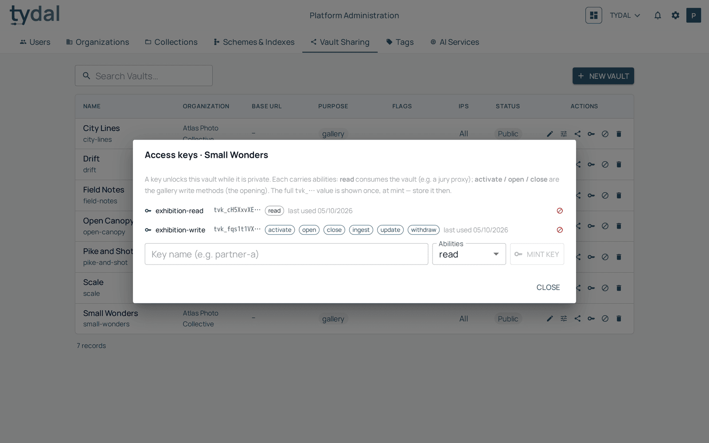
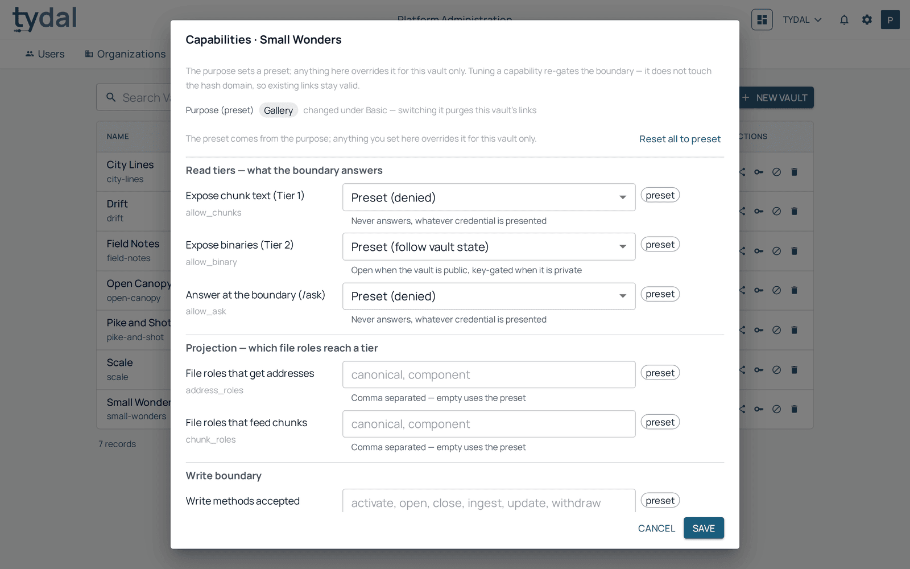
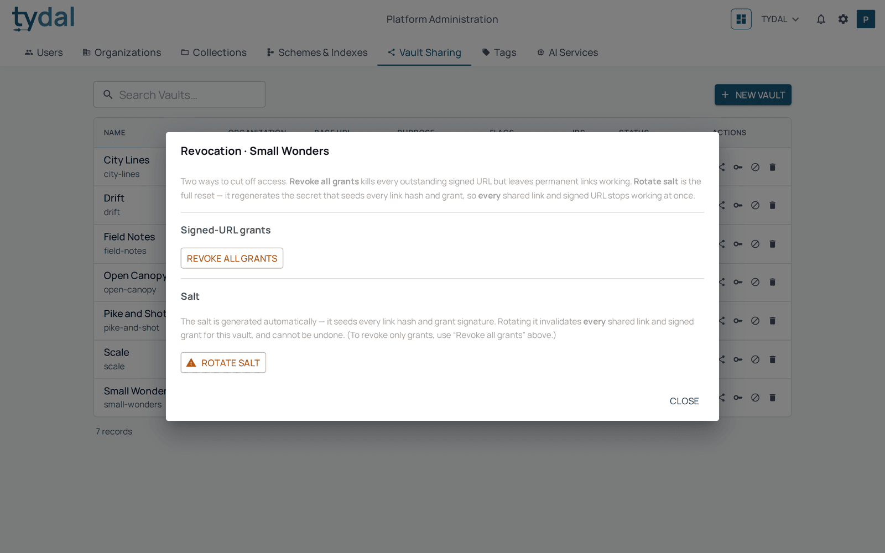

# 6 · Workspaces and vaults

[TYDAL user guide](README.md) › Workspaces and vaults

## Workspaces

A workspace is a named group of resources: an exhibition, a project, a
shortlist, a client delivery. A resource can be in any number of workspaces, and
a workspace can mix resources from different collections. Every organization
also has **All Resources**, which holds everything.

**Who does what**

- Editors add resources to workspaces and take them out (in the resource editor,
  or with the basket's **Workspace** action) — except in a workspace connected to
  a vault. Changing what such a workspace holds publishes or unpublishes
  resources outside TYDAL, so only administrators and owners can do it; editors
  see it greyed out, with the hint *Shared through a vault — ask an
  administrator*.
- Administrators and owners create, rename and delete workspaces, connect them
  to vaults, and add or remove resources in any workspace.

### Managing workspaces

*Administrators and owners.* The **⋮** after the last workspace in the second
row opens **Manage Workspaces**:

- **New workspace** creates one.
- The pencil edits a workspace's name and description, and its **Vault
  Configurations**: click a vault to connect the workspace to it, or to
  disconnect it.
- The bin deletes a workspace. Its resources aren't deleted, they just stop
  belonging to it. If the workspace was connected to a vault, those resources
  stop being shared through it.

A padlock chip beside a workspace (*Open Canopy* above) names the vault it is
connected to.

**Managed by the system.** The workspaces listed under this heading (*Drift —
selection*, *City Lines — selection*…) are created and kept up to date by other
processes, such as an exhibition's "open" step in FullFrame. You can't rename or
delete them here, and they aren't offered as tabs. The batches created by the
upload wizard's **Auto** option aren't listed here: they live on the **AiTy
Review** page, where they can be reviewed and deleted ([chapter 3](03-adding-resources.md)).

## Vaults: sharing outside TYDAL

Everything in TYDAL is private to its organization. A **vault** is how a
selection of it is shown to the outside world: a website (for example a
FullFrame exhibition), an app, a partner, or someone else's AI. A vault:

- shows the resources of the **workspaces connected to it**, and nothing else;
- has a **purpose** that decides how much it reveals: a *gallery* vault shows
  images and captions; an *ai* vault lets an AI read the text inside documents;
  a *delivery* vault hands out files;
- has an **address**, and a **state** that decides who can use it:

| State | Who gets in |
|---|---|
| **Disabled** | Nobody. Every address stops working. |
| **Private** | Only those who hold a **key** or a time-limited **signed link**. |
| **Public** | Anyone with the address. |

A vault is a window, not a copy. Change a resource in TYDAL and every vault
showing it shows the change. Archive or delete it, or take it out of the
workspace, and it disappears from the vault.

### Seeing where a resource is shared

Open a resource and choose **Vault Links**: each row is a vault that shows it,
with its address. A workspace that is connected to vaults shows them in its tab
too, with buttons to copy the public address or open the vault.

## Setting up a vault

*Platform administrators.* Vaults are created and configured in **Platform
administration → Vault Sharing**. Organization administrators then connect
workspaces to them (above). Ask your platform administrator for a new vault.
(For FullFrame exhibitions, the `exhibitions:create` command does all of this,
see the FullFrame guide.)

Each vault row has these actions: edit (name, purpose, organization),
**Capabilities**, **Sharing & reach**, **Access keys**, **Revocation**, and
delete.

### Sharing & reach

How the outside world gets in:

- **State**: disabled, private or public (above).
- **Workspaces (reads from)**: which workspaces the vault shows. It's locked
  while a FullFrame exhibition is open, because the exhibition's selection
  decides what is shown.
- **Include default workspace**: show everything in the organization.
- **Allow download and raw image display**: off means visitors get
  display-sized previews, not your original files.
- **Addresses**: the **human URL** (`/v/organization/vault`, readable) and the
  **machine URL** (`/h/…`, an opaque code that reveals no names). Both open the
  same vault.
- **Signed URLs**: time-limited links to the whole vault or to one resource,
  for sharing a private vault for a few days without handing out a key.

### Access keys

A key lets an app or a person into a **private** vault. Each key has
**abilities**: *read* to look; *activate*, *open*, *close* to publish a FullFrame
exhibition; *ingest*, *update*, *withdraw* to add and correct resources from
outside (for example a FullFrame curator's uploads). Name the key after who
will use it, choose its abilities and click **Mint key**.

The full key (`tvk_…`) is shown **only once**, when it's created. Copy it then.
Afterwards only its first characters are shown. The red icon revokes a key
immediately.

### Capabilities

What the vault reveals at each level: names and captions, the text inside
documents, the original files, and which kinds of file. The vault's purpose sets
sensible defaults (marked *preset*); a platform administrator can override them
one by one.

### Revocation

Two buttons to cut access in a hurry:

- **Revoke all grants**: every signed link stops working; keys and addresses
  are unaffected.
- **Rotate salt**: the full reset. Every signed link and every shared link to an
  individual resource or file stops working, and new ones are generated. Use it
  only when something secret has leaked; anyone who kept old links needs new
  ones.

---

← [The basket and bulk actions](05-basket.md) · [Contents](README.md) · [Deleting and the trash](07-trash.md) →
