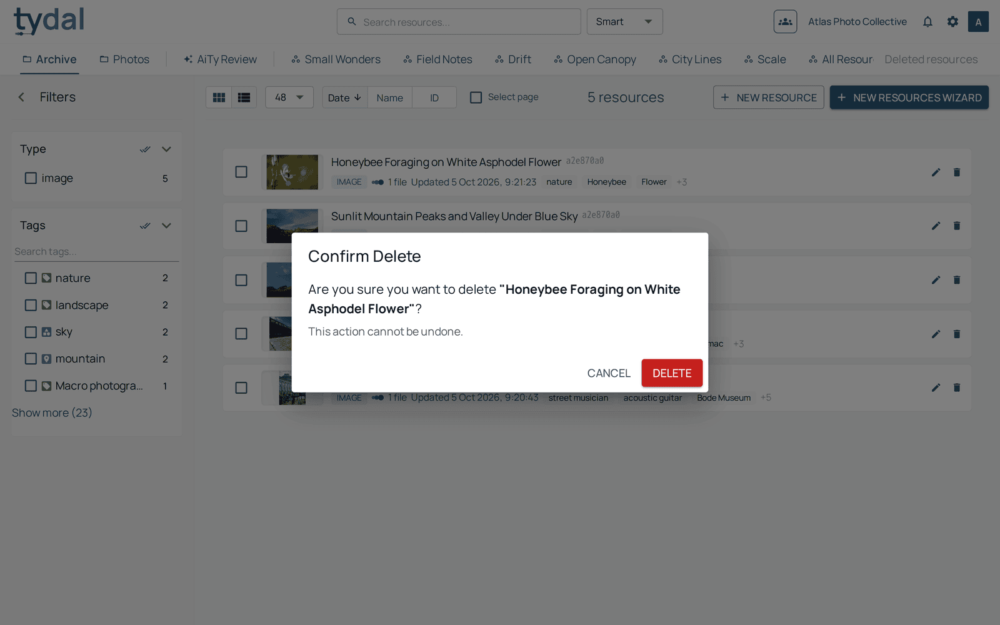
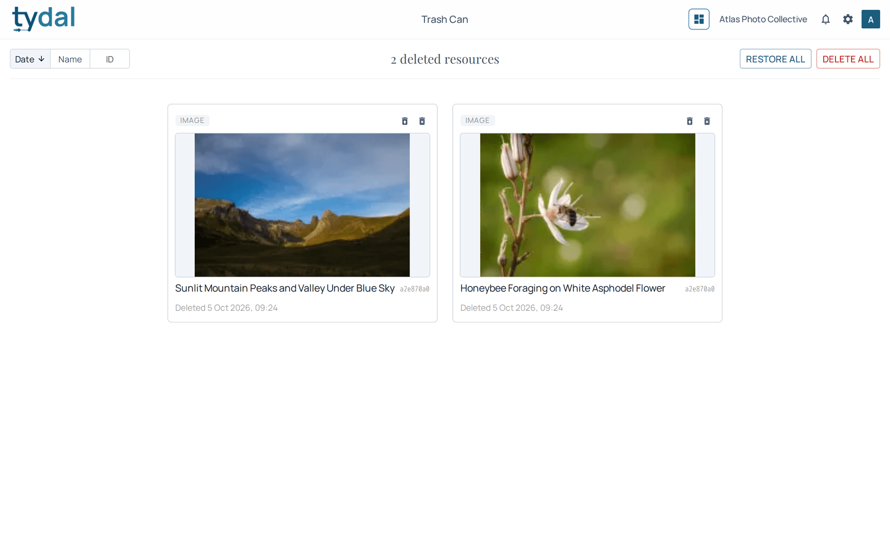
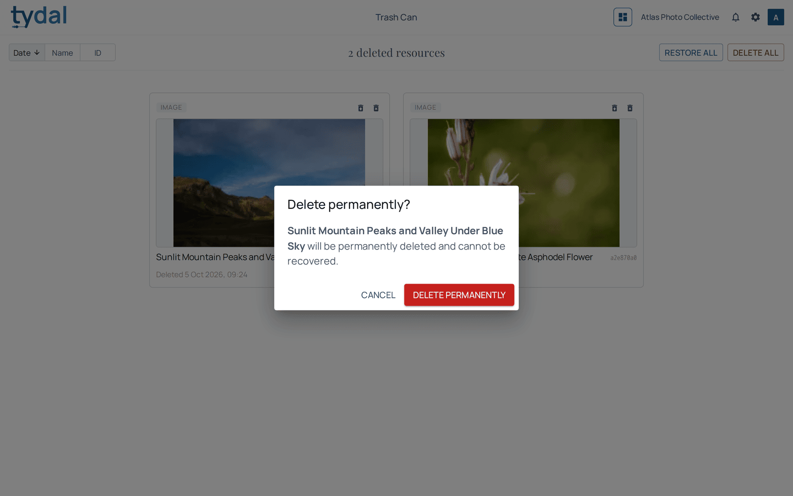

# 7 · Deleting and the trash

[TYDAL user guide](README.md) › Deleting and the trash

*Editors delete the resources they uploaded; administrators and owners can
delete any resource.*

## Deleting

Hover over a card and click the bin at its top right (in the list layout, the
bin is at the end of the row). To delete
many at once, put them in the basket and use **Delete** ([chapter 5](05-basket.md)).

A deletion **can be undone**: the resource
goes to the trash. It leaves the library, searches and every vault straight
away. (Drafts, the unfinished resources of an upload, are removed outright.)

## The trash

**Deleted resources**, at the far right of the second row, opens the trash.

- **Editors** see the resources *they* deleted. **Administrators and owners** see
  everything deleted in the organization.
- Sort by **date**, **name** or **ID**.
- On each card, the first icon **restores** the resource: it returns to its
  collection and workspaces as it was. The second **deletes it permanently**.
- **Restore all** brings everything back; **Delete all** empties the trash.

Permanent deletion asks for confirmation and **cannot be undone**: the resource
and its files are gone.

## Automatic clean-up

TYDAL empties the trash by itself: resources that have been in it for **30 days**
are deleted permanently every night. Your installation may use a different
period, so ask your platform administrator if it matters.

---

← [Workspaces and vaults](06-workspaces-and-vaults.md) · [Contents](README.md) · [Running your organization](08-organization-settings.md) →
