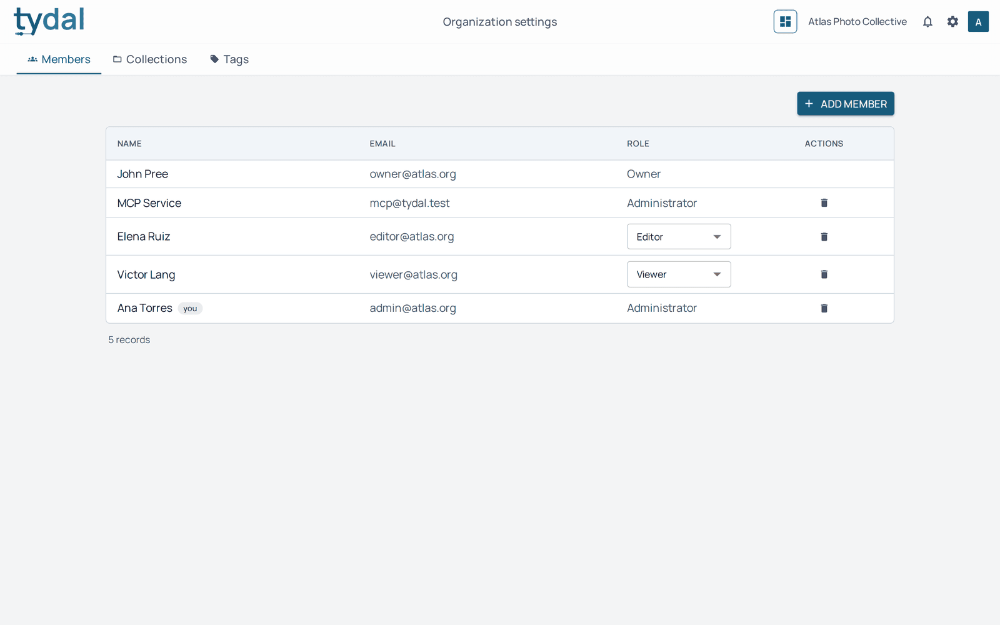
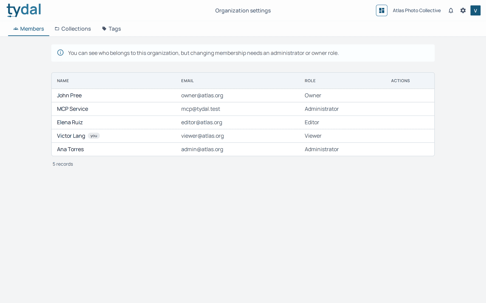
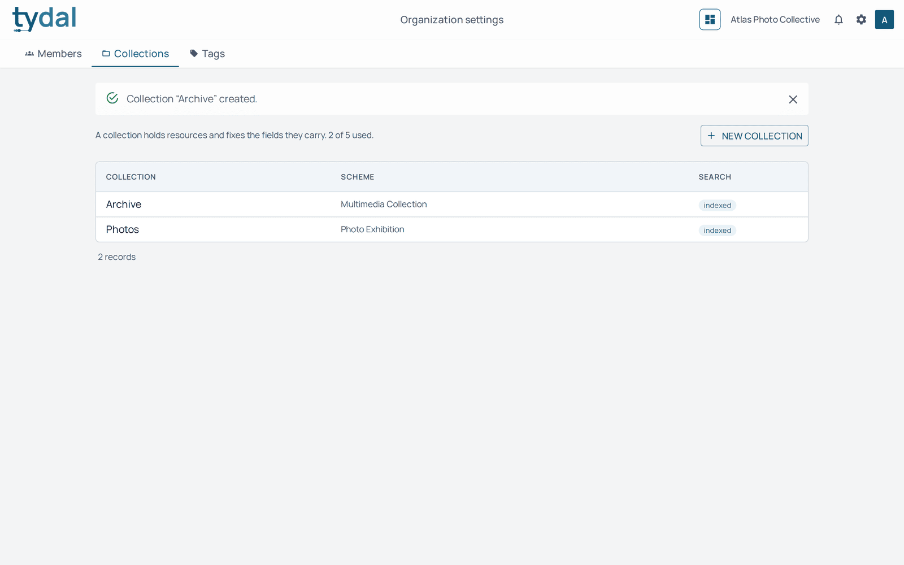
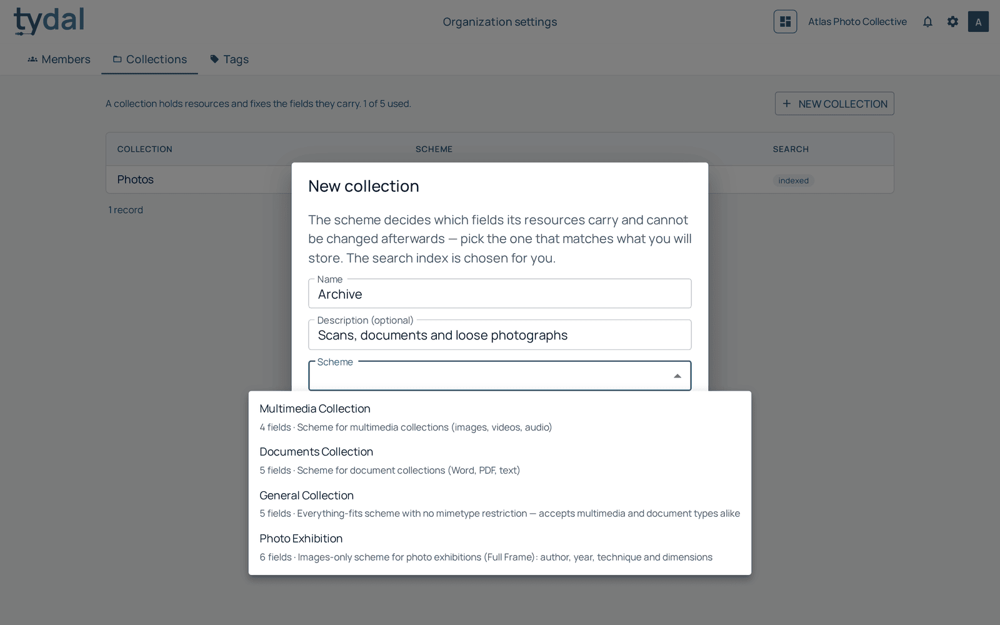

# 8 · Running your organization

[TYDAL user guide](README.md) › Running your organization

*Administrators and owners.*

The **organization settings** button in the top bar (the people icon, left of
your organization's name) opens three tabs: **Members**, **Collections** and
**Tags**. They always concern the organization chosen at the top right.

## Members

The list shows everyone in the organization and their role. (Editors and viewers
have no button for this page; if they open its address, they get the list
without any controls.)

- **Add member** adds someone who **already has a TYDAL account**, by email, with
  a role. Accounts themselves are created by a platform administrator
  ([chapter 9](09-platform-administration.md)).
- Change a role with the menu in the **Role** column.
- The bin removes someone from the organization. They lose access to it, but
  their account and the resources they created stay.

Who can hand out which role:

| You are | You can give |
|---|---|
| Owner | owner, administrator, editor, viewer |
| Administrator | editor, viewer |

No one can give a role higher than their own. An organization can have several
owners, and the last owner can't be removed or demoted, so an organization is
never left without one. To hand over ownership, appoint the new owner first.

Accounts that act on behalf of software, such as an AI assistant connected over
MCP (*MCP Service* above), appear as ordinary members with a role. Treat them
like people: give them the lowest role that does the job. See the
[agent guide](../AGENT_GUIDE.md).

## Collections

A collection is where resources are stored, and its **scheme** fixes which
fields they carry (author, year, technique…) and which of those are filters.

**New collection** asks for a name, an optional description and a **scheme**.
Only the schemes your organization is offered are listed, each with its number
of fields. **The scheme can't be changed afterwards**, so pick the one that
matches what you'll store. The search index is chosen for you.

The note above the list shows how many collections your organization may have
(*2 of 5 used*). A platform administrator can raise the limit. In the **Search**
column, *indexed* means full search, filters and AI features; *database only*
means keyword search only.

## Tags

The organization's tag vocabulary: see
[chapter 4](04-tags.md#the-organizations-vocabulary).

---

← [Deleting and the trash](07-trash.md) · [Contents](README.md) · [Platform administration](09-platform-administration.md) →
