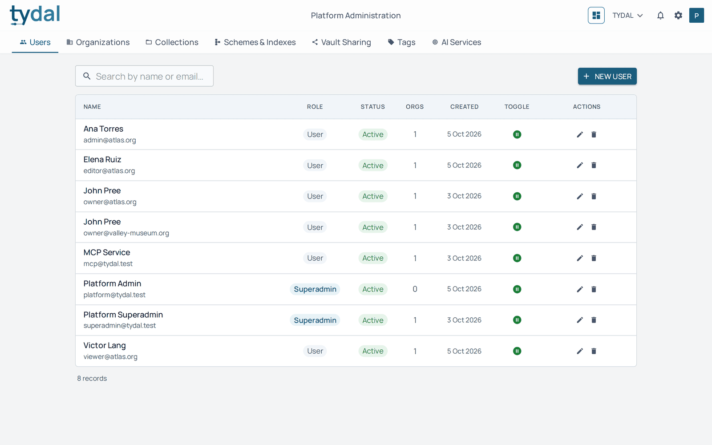
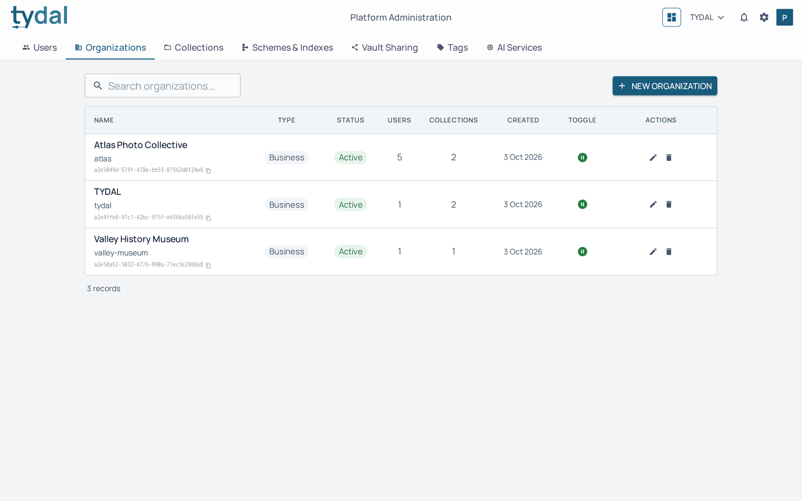
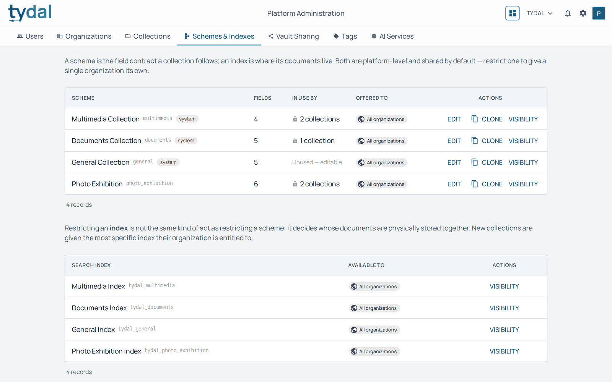
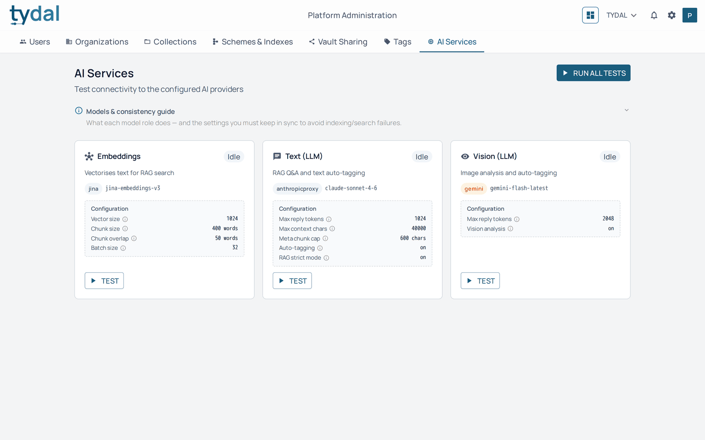

# 9 · Platform administration

[TYDAL user guide](README.md) › Platform administration

*Platform administrators only.*

Platform administrators run the TYDAL installation: they create accounts and
organizations, decide which schemes and indexes each organization may use,
configure vaults, and check the AI services. This chapter covers the screens.
Installing, upgrading, backups and command-line maintenance are in the
[Deployment Guide](../../DEPLOYMENT.md) and the [CLI Guide](../CLI.md).

Open it with the **platform administration** button (the shield) in the top bar.
Its tabs:

| Tab | What it covers |
|---|---|
| **Users** | Every account on the installation |
| **Organizations** | Every organization |
| **Collections** | Collections across all organizations |
| **Schemes & Indexes** | The field definitions and search indexes organizations can use |
| **Vault Sharing** | Every vault ([chapter 6](06-workspaces-and-vaults.md#setting-up-a-vault)) |
| **Tags** | The tags of the organization chosen at the top right (the same screen as Organization settings → Tags) |
| **AI Services** | The AI models TYDAL is connected to |

A platform administrator can switch to any organization at the top right and work
there with full access, without being a member.

## Users

**New user** creates an account. The pencil edits it: name, email, **Active**
(an inactive account can't sign in), **Superadmin** (makes the person a platform
administrator; use sparingly), and the **organizations** the person belongs to,
with a role in each. The bin deletes the account.

## Organizations

**New organization** asks for a name, a type, the owner's email (an existing
account) and a description. Each organization can be **Active** or
**Suspended**; a suspended organization's members can't use it. The list shows
how many users and collections each has.

## Schemes & Indexes

A **scheme** is a set of field definitions: which fields a collection's resources
have, which are required, which are filters, which file types are accepted. An
**index** is where the resources are made searchable.

- **Edit** changes a scheme's fields. A scheme already used by a collection is
  locked (the list says *Unused — editable* for those that aren't), because
  changing it would invalidate existing resources. Use **Clone** to start a new
  version.
- **Visibility** decides which organizations are offered a scheme or index:
  *All organizations*, or *Selected organizations* only.

## Collections

The **Collections** tab shows the collections of every organization, with their
scheme, accepted file types and fields. A platform administrator can create a
collection for any organization, set the **suggestion language** (the language
AiTy writes in), deactivate, duplicate or delete one.

## AI Services

Shows the AI models the installation uses, for **embeddings** (search by
meaning), **text** (answers, tagging) and **vision** (reading images), with their
settings. **Test** checks one; **Run all tests** checks them all. Changing models
is done in the server configuration, see
[AI Surfaces](../architecture/AI_SURFACES.md).

---

← [Running your organization](08-organization-settings.md) · [Contents](README.md)
